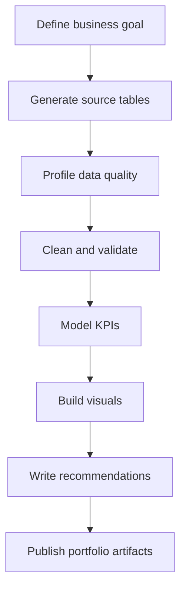

# Analytics Workflow

```mermaid
flowchart TD
    A["Define business goal"] --> B["Generate source tables"]
    B --> C["Profile data quality"]
    C --> D["Clean and validate"]
    D --> E["Model KPIs"]
    E --> F["Build visuals"]
    F --> G["Write recommendations"]
    G --> H["Publish portfolio artifacts"]
```
