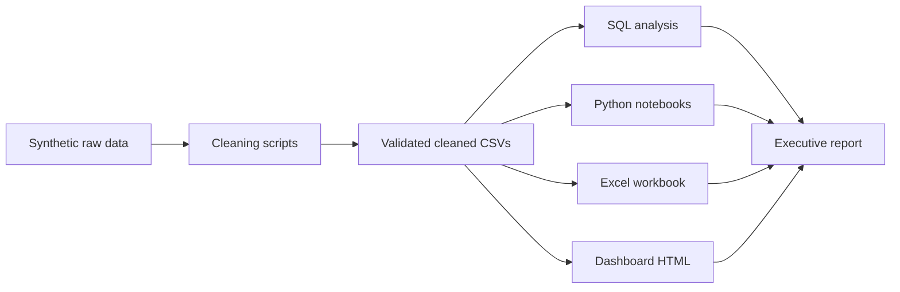

# Data Flow

```mermaid
flowchart LR
    A["Synthetic raw data"] --> B["Cleaning scripts"]
    B --> C["Validated cleaned CSVs"]
    C --> D["SQL analysis"]
    C --> E["Python notebooks"]
    C --> F["Excel workbook"]
    C --> G["Dashboard HTML"]
    D --> H["Executive report"]
    E --> H
    F --> H
    G --> H
```
