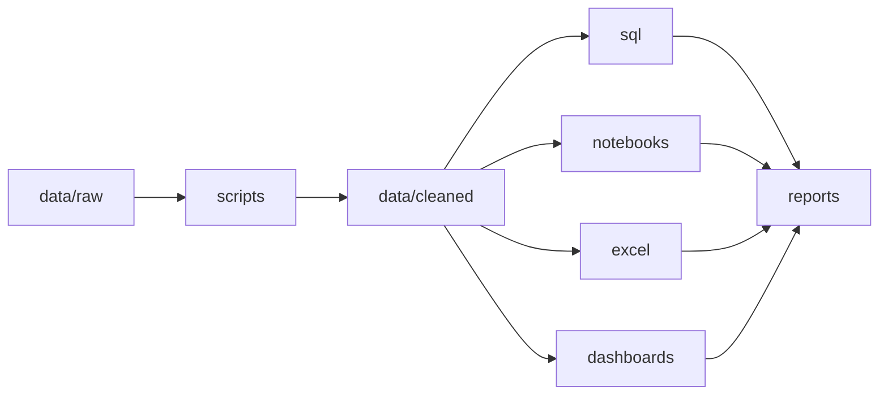

# Project Architecture

```mermaid
flowchart LR
    A["data/raw"] --> B["scripts"]
    B --> C["data/cleaned"]
    C --> D["sql"]
    C --> E["notebooks"]
    C --> F["excel"]
    C --> G["dashboards"]
    D --> H["reports"]
    E --> H
    F --> H
    G --> H
```
